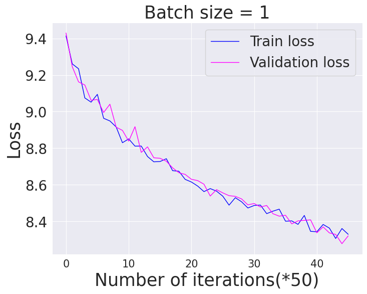

# Data
We use  [no_robots](https://huggingface.co/datasets/HuggingFaceH4/no_robots) data set. The train data size 3166084, and the test data size 169998. 

# Parameters
```
The number of parameters in Llamma2-7b = 6738149376 that is non-trainable.
The additional number of parameters for LORA model = 5141504 that is trainable.
The size of the trainable parameters is 0.0763 % of the base model parameters.

```

# Llamma 2 weights and tokenizer
Please go to this [website](https://ai.meta.com/llama/) and follow the process. Please download only base models.


# Install
1. Clone the repository
```
git clone https://github.com/ghoshsubh/LLM.git
cd LLM/Llama2/SFT_with_LORA

```
2.Install the packages
```
conda env create -f environment.yml
source activate LLM
```


# Requirements
You need at least `one 46 GB gpu` to fine tune `llamma2-7B with LORA(rank=2)` model with the fine-tune data set. I use `one A-40 46GB` gpu.

# Training
The following will utilize only `one gpu`. use_amp = 0 indicates `no mixed precision`. As all tensors operations take place in `torch.float16`, we do not need mixed precision concept. 
```
torchrun --standalone --nproc_per_node=0 train.py --use_amp 0 --data no_robots --max_iter 2300 --batch_size 1

```
If you have more than one gpus, well, congratulation. The following will utilizes `all gpus` in a node.  
```
torchrun --standalone --nproc_per_node=gpu train.py --use_amp 0 --data no_robots --max_iter 2300 --batch_size 2

```
# Note related to `error`
As all computations take place in `torch.float16` that has low precision than `torch.float32`, you may likely see `nan` when we update `LORA` parameters. Just change `eps=1e-08` to `eps=1e-04` in `Adam` or `AdamW`. I already did in my case. 

# Results

As I do not have much computation, I could train for the fine tuning data set till 2300 iterations. Please see the loss vs iterations curve. I will keep updating the figure the future.



